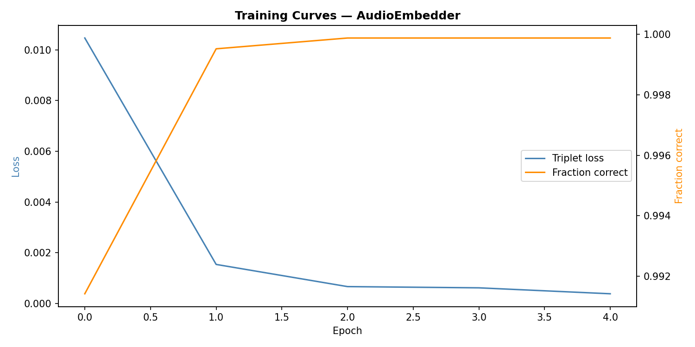
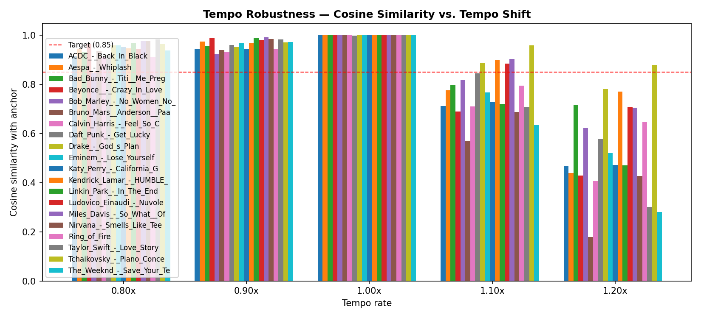
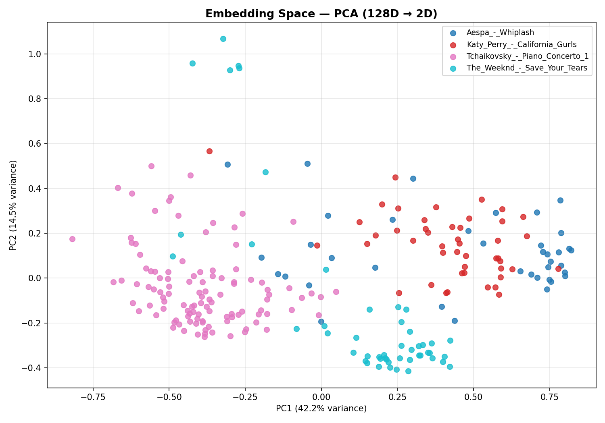

# Better Shazam — Audio Fingerprinting System

A from-scratch audio identification system that replicates Shazam's core functionality, but better.

Shazam identifies songs by converting audio into a spectrogram and matching frequency patterns against a database. This project replicates that pipeline from scratch, then extends it with a custom-trained neural network to handle noise and tempo-shifted audio that classical fingerprinting cannot identify.

---

## What It Does

Given a 10-second microphone recording, the system identifies which song
is playing and returns the title, artist, and a confidence level.

Two identification paths run simultaneously and cross-validate each other:

- **Classical path** — extracts spectrogram peaks, hashes peak pairs into
fingerprints, and matches them against a SQLite database using a
time-coherence voting algorithm. Fast and precise for clean audio.
- **ML path** — runs audio through a trained CNN that maps mel spectrograms
to 128-dimensional embedding vectors, then searches a FAISS index by cosine
similarity. Robust to background noise and tempo shifts that break the
classical path.

The final result combines both paths:
- **HIGH CONFIDENCE** — both paths agree
- **MODERATE CONFIDENCE** — one path confirms the other
- **LOW CONFIDENCE** — paths disagree, classical result returned

---

## System Pipeline

```
Microphone
↓
Demucs source separation      — removes background noise, crowd, talking
↓
Wiener filter                 — removes residual stationary hiss/hum
↓
Butterworth bandpass (80–8000 Hz)
↓
Mel spectrogram (128 bins, STFT n_fft=2048, hop=512)
↓
├── Classical path: peak extraction → SHA-1 hashing → SQLite lookup
└── ML path: CNN → 128-dim embedding → FAISS nearest neighbor
↓
Song title + artist + confidence
```

---

## Audio Preprocessing

Raw microphone input is captured at 22050 Hz mono and passed through a
three-stage noise removal pipeline:

1. **Demucs (htdemucs)** — a pretrained neural source separation model that
splits audio into stems (drums, bass, vocals, other) and recombines them.
Non-musical content like crowd noise and background conversation is
discarded because it has no stem to land in.
2. **Wiener filter** — removes residual stationary noise left after stem
separation using statistical noise floor estimation.
3. **Butterworth bandpass filter** (80–8000 Hz) — removes sub-bass rumble
and ultrasonic artifacts outside the musically relevant range.

The same pipeline is applied identically to both song registration and query
audio to ensure fingerprint consistency.

---

## Classical Fingerprinting

The cleaned audio is converted to a mel spectrogram. Local maxima are
extracted as sparse peak points using a 20×20 neighborhood maximum filter
with a frequency ceiling at mel bin 100 to reduce artifacts.

Each anchor peak is paired with up to 15 nearby target peaks within a
sliding time window. Each pair is SHA-1 hashed into a 32-bit fingerprint
encoding `(anchor_freq, target_freq, time_delta)` and stored in SQLite with
an index on hash for O(1) lookup.

At query time, matching hashes are retrieved and grouped by candidate song.
A genuine match produces many hashes that agree on the same
`db_offset − query_offset` delta — confirmed by a time-coherence histogram.
False positives produce random, incoherent deltas and are rejected.

---

## ML Embeddings

### Architecture

A custom 4-layer CNN maps mel spectrograms to 128-dimensional
L2-normalised embedding vectors:

```
Conv2d → BatchNorm → ReLU → MaxPool  (×4)
↓
AdaptiveAvgPool
↓
Linear → 128-dim output
↓
L2 normalisation
```

### Training

The model is trained using **triplet loss with semi-hard negative mining**:

- **Anchor** — a clean 5-second clip from a song in the database
- **Positive** — an augmented version of the same clip
- **Negative** — the most confusable clip from a different song, selected
by finding semi-hard negatives satisfying:
  `d(anchor, positive) < d(anchor, negative) < d(anchor, positive) + margin`

Negatives are re-mined at the start of each epoch using the current model
state, so difficulty increases automatically as the model improves.

**Augmentation pipeline applied to positive clips:**
- TimeStretch ±20% (tempo variation)
- AddGaussianNoise
- AddColorNoise
- RoomSimulator (reverb)
- LowPassFilter (speaker simulation)
- TanhDistortion (speaker distortion)
- Applied twice per clip for heavier distortion

**Training configuration:**
- Dataset: 20 songs × 10 evenly-spaced clips × 20 augmentations = 4,000
triplets per epoch
- Clips are sampled evenly across the full song duration to cover intro,
verse, chorus, bridge, and outro
- Epochs: 15 with CosineAnnealingLR (1e-4 → 1e-6)
- Spectrogram cache: Demucs preprocessing is cached to disk before training
to avoid reprocessing audio 15 times per clip
- Optimizer: Adam, lr=1e-4

### Training Curves



*Triplet loss, fraction correct, and learning rate decay over 15 epochs.
The oscillating pattern reflects hard negative mining regenerating harder
triplets each epoch as the model improves. Fraction correct ends at 0.899.*

| Epoch | Avg Neg Distance | Loss | Correct | LR |
|-------|-----------------|------|---------|-----|
| 1 | 0.153 | 0.065 | 0.920 | 9.89e-05 |
| 3 | 0.529 | 0.103 | 0.864 | 9.05e-05 |
| 5 | 0.518 | 0.116 | 0.851 | 7.52e-05 |
| 8 | 0.555 | 0.109 | 0.866 | 4.53e-05 |
| 11 | 0.628 | 0.089 | 0.904 | 1.74e-05 |
| 15 | 0.687 | 0.126 | 0.899 | 1.00e-06 |

### Tempo Robustness



*Cosine similarity between clean anchor embeddings and tempo-shifted
versions at 0.80x–1.20x across all 20 database songs. Red dashed line
shows the 0.85 target threshold.*

The ML path correctly identifies songs at tempo shifts that completely
break classical fingerprinting — hash time deltas change with tempo,
making classical matching impossible at any significant speed variation.

### Embedding Space



*PCA projection of 128-dimensional song embeddings to 2D (29.1% + 13.6%
variance explained). Acoustically distinct songs such as Tchaikovsky and
Save Your Tears show clear spatial separation. Similar-genre songs cluster
together as expected — this reflects genuine acoustic similarity rather
than a model failure.*

---

## Dual-Path Matcher

Both paths run in parallel via Python threading. Results are combined:

| Condition | Output |
|---|---|
| Both paths agree, ML similarity > 0.70 | HIGH CONFIDENCE |
| Classical in ML top 3 | MODERATE CONFIDENCE — classical confirmed by ML |
| ML only match | MODERATE CONFIDENCE — ML only |
| Classical only, confidence > 35 | CONFIDENT — strong classical match |
| Neither matches | NO MATCH |

---

## Project Structure

```
Better-Shazam/
├── audio/
│   ├── capture.py           # Microphone recording + noise profiling
│   └── preprocess.py        # Demucs + Wiener + bandpass pipeline
├── fingerprint/
│   ├── spectrogram.py       # Mel spectrogram + peak extraction
│   ├── hash.py              # Peak pairing and SHA-1 hashing
│   └── database.py          # SQLite fingerprint store + registration
├── ml/
│   ├── dataset.py           # Triplet dataset builder + hard negative mining
│   ├── model.py             # CNN architecture + training loop
│   └── embeddings.py        # FAISS index build, query, visualisation
├── matcher.py               # Dual-path matcher (threaded)
├── main.py                  # Entry point
├── test_songs/              # Your song library (WAV/MP3 files)
└── ml/spectrogram_cache/    # Precomputed spectrograms for training
```

---

## Setup

### 1. Clone and install dependencies

```bash
git clone https://github.com/yourname/Better-Shazam
cd Better-Shazam
pip install -r requirements.txt
brew install ffmpeg   # macOS, required for audio conversion
```

### 2. Add songs to identify

Drop WAV or MP3 files into the `test_songs/` folder named `Artist - Title.mp3`.
These are the songs the system will be able to identify.

### 3. Register songs and train

```bash
python tests/test_phase5.py
```

This will:
1. Convert all files in `test_songs/` to 22050 Hz mono WAV and register them in SQLite
2. Build a spectrogram cache for all songs using Demucs (runs once, cached to `ml/spectrogram_cache/`)
3. Build 4,000 triplets per epoch using semi-hard negative mining
4. Train for 15 epochs with cosine LR decay
5. Save weights to `ml/embedder.pt` and generate `ml/training_curves.png`
6. Build the FAISS index
7. Run tempo robustness evaluation and generate `ml/tempo_robustness.png`
8. Generate a PCA visualisation of the embedding space

To skip already-completed steps:
```bash
python tests/test_phase5.py --skip-register   # reuse existing songs.db and wav_cache
python tests/test_phase5.py --skip-train      # reuse existing model weights
python tests/test_phase5.py --skip-record     # reuse saved mic snippet
```

### 4. Identify a song

```bash
python main.py
```

Records 10 seconds from your microphone. Make sure the song is playing
loudly enough to be picked up clearly.

---

## Key Design Decisions

**Why two paths instead of one?**
Classical fingerprinting is fast and exact but breaks under noise and tempo
variation. ML embeddings are robust but imprecise on acoustically similar
songs. Running both and cross-validating gives higher confidence than either
alone and makes failure modes explicit in the output.

**Why semi-hard negative mining instead of random negatives?**
Random negatives (e.g. pairing a K-pop song against classical music) are
trivially easy — the model solves them in the first epoch and learns nothing
further. Semi-hard negatives are the most confusable songs given the current
model state, forcing the model to learn fine-grained distinctions throughout
all 15 epochs. This produces the oscillating training curve visible above.

**Why remove GTZAN from training?**
Initial experiments included GTZAN for general audio understanding. However
GTZAN teaches genre-level separation (blues vs classical vs hip hop) which
caused embeddings to cluster by genre rather than by individual song.
Removing GTZAN and training exclusively on the 20 database songs forced
song-level discrimination, producing better separation in the embedding
space for the specific identification task.

**Why Demucs over spectral subtraction?**
Spectral subtraction requires a clean noise reference sample captured before
recording begins. Demucs requires no reference — it separates music from
non-music using a pretrained source separation model, allowing music to play
from the first second of recording.

---

## Limitations

- The system can only identify songs that have been registered in its
database. This is a fundamental property of all audio fingerprinting
systems including Shazam — a song must be explicitly added before it can
be matched.
- The ML path performs best on acoustically distinct songs. Similar-genre
songs (multiple upbeat pop songs, multiple hip hop songs) produce nearby
embeddings and the classical path carries more weight for those cases.
- Tempo robustness is validated at ±20% training range. The iOS Voice Memos
fast setting (1.5x) exceeds this range and may not match reliably via the
ML path — the classical path is also unlikely to match at 1.5x due to hash
time delta drift.

---

## Key Constants

| Constant | Value |
|---|---|
| Sample rate | 22050 Hz |
| Clip length | 5 seconds (training) / 10 seconds (query) |
| Channels | Mono |
| Mel bins | 128 |
| Embedding dimension | 128 |
| Hash fan-out | 15 |
| STFT n_fft | 2048 |
| STFT hop length | 512 |
| Triplet margin | 0.3 |
| Training epochs | 15 |
| Learning rate | 1e-4 → 1e-6 (cosine decay) |
